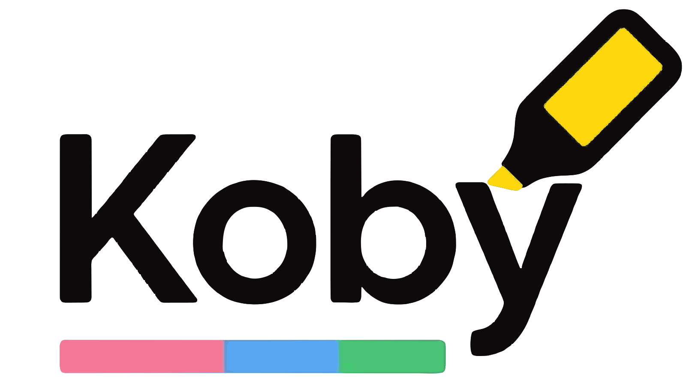

# Koby

<p align="center">
  
</p>

<p align="center">
  <a href="https://koby.luarai.com/"><strong>Visit the website »</strong></a>
</p>

Koby is a web application that allows users to store, view, and share their Kobo e-reader highlights. It provides a personal space for users to visualize their reading habits and stats.

## Features

*   **Upload Highlights:** Easily upload your Kobo highlights file.
*   **Visualize Stats:** Get insights into your reading habits with charts and graphs.
*   **Share Highlights:** Share your favorite highlights with the world.
*   **Trending Highlights:** Discover what other users are highlighting.
*   **Filter and Search:** Easily find specific highlights with filters and search functionality.

## Usage Options

There are two ways to use Koby:

1.  **Local Processing:** Use the provided Python scripts to process your Kobo files locally and then manually upload the generated `json` files to the website. This option does not require a Firebase setup.
2.  **Self-Hosted Firebase:** Set up your own Firebase instance to use the full functionality of the web application, including cloud functions for automatic processing.

## Getting Started (with Self-Hosted Firebase)

### Prerequisites

*   Node.js (v18 or higher)
*   Firebase CLI
*   A Firebase project

### Installation and Setup

1.  **Clone the repository:**
    ```bash
    git clone https://github.com/SanJoao/kobo.git
    cd koby
    ```

2.  **Configure Firebase:**
    *   Create a new Firebase project in the [Firebase console](https://console.firebase.google.com/).
    *   Update the `.firebaserc` file with your project ID.
    *   Update the `firebaseConfig` object in `firebase-init.js` with your project's configuration.

3.  **Install backend dependencies:**
    ```bash
    cd functions
    npm install
    ```

### Running the application

1.  **Serve the application:**
    ```bash
    firebase emulators:start
    ```
    This will start the Firebase emulators for the backend functions.

2.  **Open the application:**
    Open `index.html` in your web browser.

## Technologies Used

*   **Frontend:**
    *   HTML
    *   CSS
    *   JavaScript
    *   Chart.js
    *   Showdown

*   **Backend:**
    *   Firebase Cloud Functions
    *   Node.js
    *   SQLite

## Deployment

To deploy the Firebase functions, run the following command:

```bash
firebase deploy --only functions
